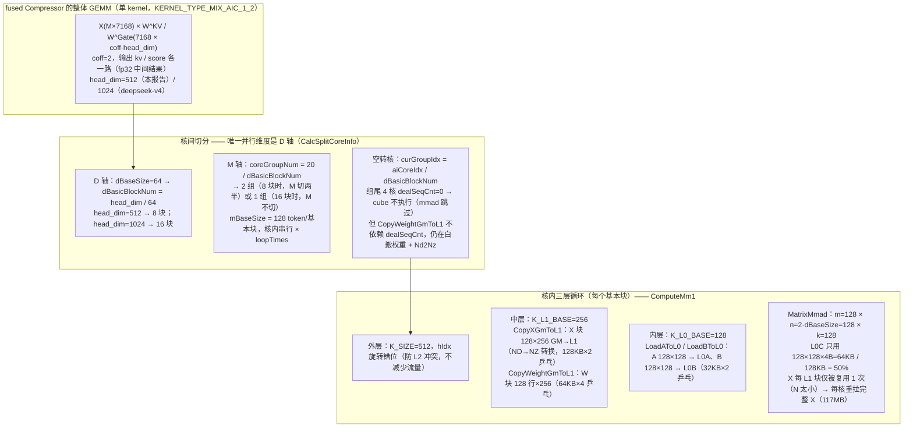
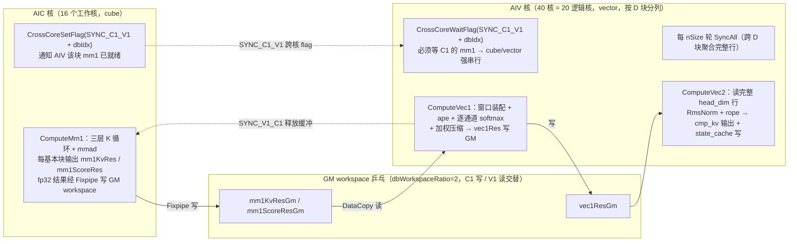

# Fused Compressor 的 GEMM 为什么慢：与 MatMulV3 的实现差异分析

## 1. 问题与量化

prefill M=8192（910B4-1，20 AIC + 40 AIV），同规模矩阵乘法（flops = 2·M·N·K = 240.5 GFLOP）msprof op 实测（独占卡，见 §5）：

| 实现 | msprof task | cube 核 | cube_ratio（干活核均值） | 有效 SOL* |
|---|---|---|---|---|
| fused `compressor`（GEMM+epilogue 混合） | 1998.4us | **16/20** | 59.1% | **47.3%** |
| split `MatMulV3`（pack N=2048 纯 GEMM） | 1046.6us | **20/20** | 89.1% | **89.1%** |
| 差距 | **1.91×** | — | — | **1.88×** |

*有效 SOL = 参与核数比例 × cube_ratio（相对 245.76 TFLOPS 峰值）。graph 模式总耗时 fused 1992.7us vs split 1297.5us（含 epilogue 与图调度）也呈同样量级差距。

差距分解（1.88× = 1.25 × 1.50）：
1. **核利用率损失 1.25×**：fused 只有 16/20 AIC 执行 mmad（4 核 cube 完全空转，PipeUtilization 实测 cube_time=0，见 §2.1/§5）；
2. **剩余效率损失 1.50×**：干活核的 cube_ratio 仅 59.1%（vs MatMulV3 89.1%）——来自 N 维度过小、格式转换、无 L2 规划、跨核同步等（§2.2-2.6）。

## 2. 差异逐项分析

### 2.1 核分配：4 个 AIC 的 cube 完全空转（实测 PipeUtilization 铁证）

fused 的核划分在 `compressor_kernel_perf.h::CalcSplitCoreInfo`：

```
dBaseSize   = 64            （tiling: compressor_tiling.cpp, PERF 模板 coff=2）
dBasicBlockNum = headDim/dBaseSize = 512/64 = 8   （D 方向 8 块）
coreGroupNum   = usedCoreNum/dBasicBlockNum = 20/8 = 2   （M 方向 2 组）
curGroupIdx    = aiCoreIdx / 8        → idx 0-15 组 0/1，idx 16-19 组 2
```

`SkipOneLoop` 末尾的安全判断（`compressor_kernel_perf.h`）：

```cpp
totalDataSize     = coreGroupNum*mBaseSize - quota;   // 每循环总量 ≤ 2×128 = 256
currentGroupStart = curGroupIdx*mBaseSize;            // 组 2 → 2×128 = 256
if (currentGroupStart >= totalDataSize) dealSeqCnt = 0;   // 恒成立 → 组 2 每轮清零
```

**实测证据**（fused M=8192，`msprof op` PipeUtilization 逐核；M=1024 与此一致）：

| block | aic_cube_time (us) | cube_ratio | aic_mte2_time (us) | 说明 |
|---|---|---|---|---|
| 0-15（16 核） | ~1180 | 58.5% | 1613-1812 | 正常干活（mmad 执行） |
| **16-19（4 核）** | **0.0** | **0.000** | **1202-1254（60%）** | **cube 完全不执行，但 MTE2 仍在搬运！** |

block 16-19 的 cube_time=0（mmad 从未执行，dealSeqCnt=0 时 `ComputeMm1` 的 mLoop 循环体跳过），但它们的 MTE2 仍占用 60%——因为 `CopyWeightGmToL1` 的 `nValue = dBaseSize`（固定 64，**不依赖 dealSeqCnt**），`ComputeMm1` 的 h/k 外层循环无条件执行权重搬运。**这 4 个核白搬权重 + 白做 Nd2Nz 转换（wkv+wgate 各 64 行×7168 列 = 1.8MB/核），却一个 mmad 都不跑**，既浪费 20% cube 算力，又额外浪费 MTE2 带宽。

> 结论：20 个 AIC 只有 16 个执行 GEMM 计算（cube 空转 20%）；且空转核不是真闲着，而是白做权重搬运。对比 MatMulV3：`usedCoreNum = aicNum_ = 20`，M 方向 20 核均分，无空转。

### 2.2 N 维度过小：128 vs 256/2048

| | fused `ComputeMm1` | MatMulV3 |
|---|---|---|
| 单核输出列数 | `nDealSize = 2×dBaseSize = 128`（wkv 64 + wgate 64 拼装） | `baseN = 256`（源码注释 "256 is better base"），pack 后整 N=2048 分块 |
| 单次 mmad | m=128, n=128, k=128（`MatrixMmad`，`MmadParams`） | m=128, n=256, k=128（L0C 128KB 版），L0C 256KB 板型 m=256 |
| L0C 利用 | 128×128×4B = 64KB / 128KB = **50%** | 128×256×4B = 128KB / 128KB = **100%** |
| A（X）矩阵每 L1 块的复用次数 | N/tileN = 1 次（128 列一次装完，仅被 wkv/wgate 两个 mmad 各用一次） | pack 后 N=2048 → 每 L1 块复用 8 次 |

N 小的连锁影响：
- **X 的 L1→L0A 搬运占比高**：fused 的 MTE2 79.6% 占用中，X 块每搬进 L1 只产出 128 列输出；MatMulV3 同样搬运产出 2048 列；
- **mmad 输出粒度小**：n=128 时 L0C 半满，cube 阵列（16×16×16 fractal，n 方向 8 列 fractal）只有一半的列方向被填充，宏观上表现为 mac_ratio 47.6% vs 82%；
- fused 内部把 wkv/wgate 拼成 n=128 是刻意设计（一次 mmad 出两路），但 128 仍远小于 910B 上 GEMM 的甜点 256+。

### 2.3 矩阵格式：fused 在 kernel 内每块做 ND→NZ 转换（MTE2 指令）

**输入为 ND**：`_run_compressor`（dsa_v1.py:1605）把 torch ND 张量直接传给 `compressor`（bench 的 x/wkv_w/wgate_w 均为 `torch.randn`；生产 `Compressor` 的 wkv/wgate 是 ReplicatedLinear 的普通 ND 权重）。

**fused 的转换**：`CopySingleMatrixNDToNZ`（compressor_comm.h:286）调用 `DataCopy(l1, gm, Nd2NzParams)`——**MTE2 的 Nd2Nz 模式搬运指令**（GM→L1 途中完成 ND→NZ 布局转换，`dstNzC0Stride` 等参数控制 NZ 的 C0 拼接，非 scalar）。X 每个 L1 块（`CopyXGmToL1`）、W 每个块（`CopyWeightGmToL1`，wkv/wgate 各一次）都执行该转换，占 MTE2 时间；空转核（§2.1）也在白做这份转换。

### 2.4 L2 缓存规划：无 vs 显式 tile

- fused：无 L2 感知。X 每核读自己行的全部 K=7168 列，W 每个 d 块核各读一份（8 个 d 块 × 64 列），跨核无 L2 复用规划，完全依赖硬件 cache。
- MatMulV3：`matmul_v3_l2_cache.cpp` 显式 L2 tile 化（`mTileCntL2 × nTileCntL2`、`calOrder` 行/列优先选择、`mCntTail/nCntTail` 尾块处理）。N=2048 的权重在 L2 里被 M 方向多个 tile 复用，GM→L1 流量显著下降。

### 2.5 算法/模板选择：固定手写 vs 15+ 模板 + AOE 调优

- fused：PERF 模板固定一套循环（K_L1=256、K_L0=128、M_L0=128 三层循环，双缓冲深度：L0A/L0B×2、L0C×2、L1 W×4、L1 X×2），无 split-K、无 K 方向多核。
- MatMulV3：tiling 时按 M/N/K/格式/精度/板型从 15+ kernel 模板动态选择（`mat_mul_v3.cpp`）：BASE（`MatmulBaseKernel`）、单核 split-K（`MatMulSingleCoreSplitKKernel`，K 方向单核多块）、多核 split-K（`MatMulMultiCoreSplitK`，fp32 大 K）、deterministic split-K、AL1/BL1 full-load（`AL1_FULLLOAD`/`BL1_FULLLOAD` 模板：A 或 B 整块驻留 L1）、`GM_TO_L1`、K_SHIFT 错位、`FIXPIPE_OPT`（VEC_NZ2ND 等），并支持 AOE 离线调优（`tilingEnable`/`GetTilingFromRepo`）。大 K（7168）场景可用 split-K 让更多核沿 K 并行。

### 2.6 流水与跨核同步开销

- fused 是 **AIC(GEMM) + AIV(epilogue) 双核型混合算子**：GEMM 结果经 workspace 乒乓（`dbWorkspaceRatio` 份，`mm1KvRes`/`mm1ScoreRes` 写 GM 再由 AIV 读回，见 `InitWorkspace`）传递，且有频繁跨核 flag 同步（`CrossCoreWaitFlag/SetFlag`，SYNC_C1/V1 每块一次）。GEMM 与 epilogue 强串行（V1 必须等 C1 的 mm1 结果），cube 与 vector 无法重叠。
- MatMulV3 是纯 cube 算子：结果直接写输出 GM（`mm_.GetTensorC`），无跨核同步、无中间 workspace 往返；L0C→GM 用 fixpipe/MTE3 与下一块 mmad 流水重叠。
- fused 手动 event/flag（`AllocEventID` 里 8 组 EVENT_ID 固定）流水深度固定为 2 级 L0 双缓冲；MatMulV3 的 `mm_.Iterate()`（Matmul 模板）按 L1 容量动态算 `depthA1/depthB1` 双缓冲深度。

## 3. 差距归因汇总

| 差异项 | fused | MatMulV3 | 影响权重 |
|---|---|---|---|
| 核利用 | **16/20 AIC 执行 mmad**（4 核 cube 空转、仍白搬权重） | 20/20 AIC | **1.25×（最大）** |
| N 维度 / L0C 利用 | 128 / 50% | 256+ / 100% | 大 |
| 格式转换 | Nd2Nz DataCopy（MTE2 指令）每块转换，N 小摊不开 | 转换成本摊在 N=2048 的 8 次复用上 | 中 |
| L2 规划 | 无 | 显式 tile | 中 |
| 模板/算法 | 固定 PERF | 15+ 动态 + split-K | 中 |
| 同步/乒乓 | 跨核 flag + workspace 乒乓 | 无 | 小-中 |

量化验证：1.25（核）× 1.50（cube 效率 59.1%→89.1%）= 1.88×，与实测任务时间差距（1998.4/1046.6 = 1.91×）吻合。

## 4. msprof op 同规模实证（M=8192，240.5 GFLOP，独占卡）

**方法**：`msprof op` 分别捕获两个应用（最后一次 launch 为目标 kernel）：`bench_mm_fused_vs_pack.py`（→ Compressor）与 `bench_mm_pack_only.py`（→ MatMulV3 N=2048）；卡 5 独占。产物 `msprof_out/mm_fused_m8192` / `msprof_out/mm_pack_m8192`。

**OpBasicInfo**：

| | fused `Compressor_..._mix_aic` | `MatMulV3_ND_ND_..._high_performance` |
|---|---|---|
| Task Duration | 1998.4us | 1046.6us |
| Block Dim | 20 AIC + 40 AIV | 20 AIC |

**PipeUtilization（逐核）**：

| 指标 | fused | MatMulV3 pack |
|---|---|---|
| 有 cube 活动的核 | **16/20**（block 16-19 cube_time=0.0us） | **20/20** |
| cube_ratio（干活核均值） | 59.1% | **89.1%**（87-92%） |
| mte1_ratio | 52.6% | 64.5% |
| mte2_ratio | 83.4%（干活核）/ **61.8%（空转核白搬权重）** | 84.2% |
| fixpipe_ratio | 2.7% | 8.8% |
| AIV vec_ratio | 3.4%（epilogue 等 AIC 结果，几乎空闲） | —（纯 cube） |

**结论**：
1. **核空转实证**：fused 的 block 16-19 cube_time=0（mmad 从未执行），但它们 mte2=61.8%——`CopyWeightGmToL1` 不依赖 dealSeqCnt，空转核仍在白搬权重 + Nd2Nz 转换；
2. **cube 效率实证**：MatMulV3 20 核全部 87-92% cube 占用（有效 SOL 89.1%），fused 干活核仅 59.1%（且只有 16 个）→ 有效 SOL 47.3%；
3. **总差距 1.91×** 与 §1 分解（1.25×1.50）吻合。

## 5. 结论与建议

1. **fused GEMM 慢不是单点问题，而是结构性劣势**：核利用少 20% + N 小一半 + 每块 ND→NZ 转换 + 无 L2/模板优化，共同造成 1.88× 差距。拆分为 MatMulV3 + epilogue（split）后，GEMM 交给经过充分调优的库实现（有效 SOL 89.1%），是正确方向。
2. **若仍需保留 fused**（省一次 GM 往返），可行的修复按收益排序：
   - 修核分配：`coreGroupNum = ceil(20/8)` 或按 `usedCoreNum` 整除 8 取 16 并申请 16 核，杜绝 4 核空转（可回 1.25×）；
   - N 方向合并更多列（如把 headDim 相关多路输出拼到 ≥256），填满 L0C；
   - 引入 L2 tile 与 split-K 模板。
3. **split 方案本身仍有空间**：epilogue ~160us 相对内存下限 ~66us 有 2.4×（见主报告第 7 节）。

## 6. 附图：fused kernel 的分块与 CV 融合结构

### 6.1 分块（Tiling）结构

图 1 说明 fused 的单 kernel 如何把 GEMM 切到核上：**并行度只来自 D 轴（head_dim 输出列）切分**，M 轴与 K 轴都是核内串行循环；而 D 块数（head_dim/64 = 8 或 16）不整除 20，导致 20 个 AIC 恒只有 16 个执行 mmad。每个工作核都要重拉完整 X（M 不跨核切分），X 每 L1 块又只被 N=128 列复用 1 次——这就是 §1 中 1.25×（核空转）× 1.50×（cube 效率）差距的结构源头。



### 6.2 CV 融合（cube + vector 双核型）流水

图 2 说明融合的形态：AIC 只做 GEMM（mm1），结果经 **GM workspace 乒乓（dbWorkspaceRatio=2）** 交给 AIV；AIV 分两段——vec1（窗口装配 + ape + softmax + 加权压缩，按 D 块分列并行）与 vec2（RmsNorm + rope + 输出/state_cache，需读完整 head_dim 行，故每 nSize 轮 SyncAll 跨 D 块聚合）。C1 与 V1 之间每块一次跨核 flag 同步（SYNC_C1_V1），**V1 必须等 C1 的 mm1 就绪，cube 与 vector 无法重叠**（§2.6）；V1 完成后再发 SYNC_V1_C1 释放 workspace 缓冲供 C1 下一块复用。



> 图注：两图均对应 §4 实测配置（fused `Compressor_..._mix_aic`，M=8192）。对比 split 方案：MatMulV3 是纯 cube 算子，M/N 二维切分 20 核全用（§2.1-2.2），epilogue 单独成核且每核独占完整 head_dim 行、无跨核同步——结构上恰好消除了图 1 的空转核与图 2 的 C/V 串行依赖。
